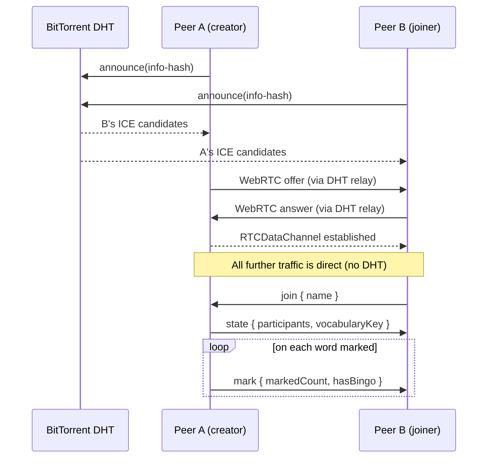
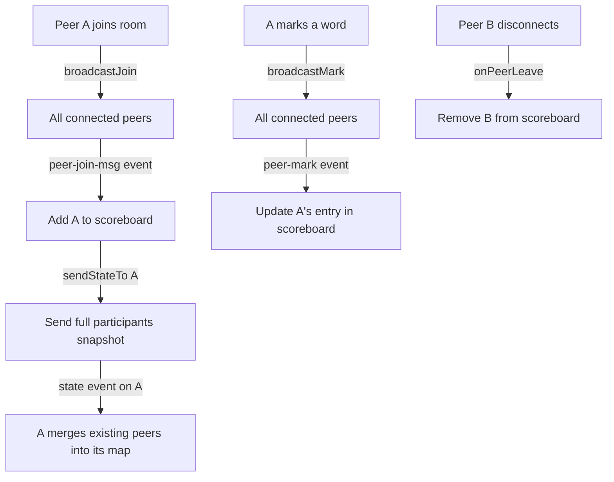

# Buzzword Bingo

A multiplayer bingo game for meetings and conferences. Players mark off buzzwords as they're heard; the scoreboard updates live across all participants with no server required.

Live: https://gfilardo.github.io/buzzword-bingo

---

**Build tooling:** [Parcel](https://parceljs.org/) — zero-config bundler that handles TypeScript and SCSS out of the box.  
**Deploy:** `npm run deploy` builds and pushes `dist/` to the `gh-pages` branch via the `gh-pages` package.

---

## P2P architecture

This app has **no backend**. Peers discover each other and exchange data entirely through a combination of the BitTorrent DHT network (for signaling) and direct WebRTC data channels (for gameplay messages).

### How it works — two phases

#### Phase 1 — Peer discovery via BitTorrent DHT (relay)

[Trystero](https://github.com/dmotz/trystero) (`@trystero-p2p/torrent`) announces a magnet-link-style identifier derived from the app ID and room code onto the public BitTorrent DHT. Every peer joining the same room announces itself and scans for others. The DHT acts as a decentralised rendezvous point — a "Bitcoin-relay" style tracker where no single server is authoritative.

```
appId: 'buzzword-bingo-v1'
roomId: <user-entered room code>
→ Trystero derives a DHT info-hash and announces it
```

#### Phase 2 — WebRTC data channels (direct)

Once two peers discover each other's ICE candidates through the DHT, they negotiate a direct WebRTC `RTCDataChannel`. All subsequent gameplay messages travel over this channel — the DHT relay is no longer involved.



### Message types

`Room` (`src/room.ts`) registers three Trystero actions, each serialised as JSON over the data channel:

| Action | Direction | Payload | Purpose |
|--------|-----------|---------|---------|
| `join` | broadcast / unicast | `{ name }` | Announce presence on connect |
| `mark` | broadcast | `{ name, markedCount, hasBingo }` | Word marked/unmarked |
| `state` | unicast → joiner | `{ vocabularyKey, participants }` | Full room snapshot for late joiners |

### State synchronisation

There is no authoritative host. Each peer maintains its own `participants` map and merges updates as they arrive.



**Late-joiner guarantee:** When a new WebRTC connection completes (`peer-connected` event), the already-connected peer also fires a unicast `sendJoinTo`, so introductions are not missed even if the initial broadcast arrived before the connection existed.

**Deterministic boards:** Each player's board is seeded with `roomCode + peerId` using a FNV-1a + Mulberry32 PRNG (`src/seeded-random.ts`). This means boards are reproducible (refresh = same board) and unique per player per room without any coordination.

---

## Running locally

```bash
npm install
npm run serve        # http://localhost:1234
```

```bash
npm run build        # production build → dist/
npm run deploy       # build + push to gh-pages branch
```

## URL scheme

| Parameter | Set by | Meaning |
|-----------|--------|---------|
| `room` | share link | Room code to pre-fill |
| `vocab` | share link | Vocabulary key to pre-select |
| `creator=1` | creator's browser | Marks user as room creator; locks room/vocab for joiners |

The share link omits `creator=1` so joiners see the correct room but cannot change the vocabulary.
